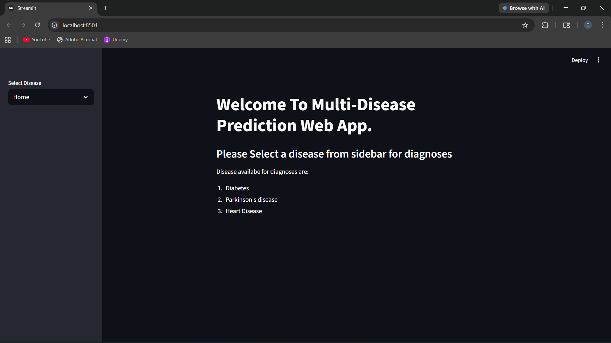
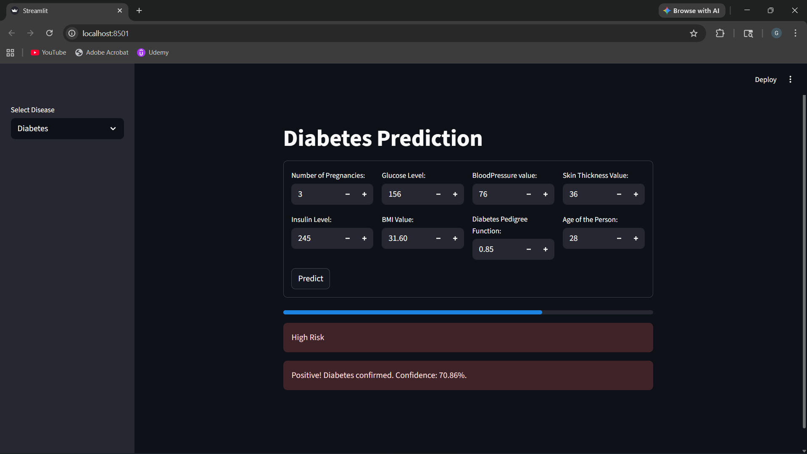

# 🩺 Disease Prediction Web App

## 📌 Overview
This project is a machine learning-based web application that predicts diseases based on user-provided symptoms. It aims to assist users in early diagnosis and provide quick preliminary insights before consulting a medical professional.

## 🚀 Features
- Predict multiple diseases based on user symptoms
- Interactive and user-friendly interface using Streamlit
- Fast predictions using a trained Random Forest model

## 🧠 Tech Stack
- Python
- Streamlit
- Scikit-learn
- Pandas, NumPy

## 📊 Machine Learning Model
- Model: Random Forest Classifier
- Dataset: Disease Prediction Dataset (Kaggle)
- Accuracy: 82% on test data (evaluated using train-test split)

## 📁 Project Structure
- app.py → main Streamlit application
- models/ → trained machine learning models
- screenshots/ → UI images for documentation

## ⚙️ Installation
```bash
git clone https://github.com/GauravShah81/disease-prediction-web-app.git
cd disease-prediction-web-app
pip install -r requirements.txt
streamlit run app.py 
```

## ▶️ Usage
- Open your browser and go to: http://localhost:8501
- Enter symptoms in the input form
- Click on "Predict" to see the result

## 📷 Screenshots



## 🌐 Deployment
This project is not deployed yet. It runs locally using Streamlit.